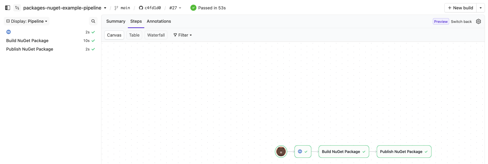

# Hello.Buildkite example NuGet package

This Github repo is configured to use Buildkite to build a NuGet packet and publish it to a NuGet registry on Buildkite Package Registries.

* Buildkite Packages NuGet Example Pipeline

<a href="https://buildkite.com/buildkite/packages-nuget-example/builds/latest?branch=main">
  
</a>

* Buildkite Packages NuGet Example 'Publish NuGet Package' Log


* Buildkite Packages Registry With Published NuGet Package'


<!-- docs:start -->

## Quick Start

* Create NuGet registry in Buildkite Package Registries
  * Name the registry: 'packages-nuget-example-registry'
    * Change '.buildkite/pipeline.yml'
      * The `publish-to-packages` plugin 'registry' should point to you `<YOUR_ORGANIZATION_SLUG>/<YOUR_REGISTRY_SLUG>`
```
- publish-to-packages#v2.2.0:
    ...
    registry: "anothertest/packages-nuget-example-registry" <==== CHANGE
    ...
```
* Add 'OIDC' policy to the NuGet registry
  * https://buildkite.com/docs/package-registries/security/oidc
```
- iss: https://agent.buildkite.com
  scopes:
    - read_packages
    - write_packages
  claims:
    organization_slug:
      equals: anothertest
    pipeline_slug:
      in:
        - packages-nuget-example-pipeline
    build_branch:
      matches:
        - main
        - feature/*
```

## Details

### Main Files

Contains the NuGet package project files that we will build.

* README.md
  * This file
* Program.cs
  * The program written in C# that we will build
* Hello.Buildkite.csproj
  * dotnet build configuration file

### '.buildkite/' Folder

Contains Buildkite setup/configuration to build the project into a NuGet package and publish to Buildkite Package Registries.

* docker-compose.yml
  * Since NuGet package build requires 'dotnet' we use 'docker-compose.yml' so we can pull/instantiate a OCI image with 'dotnet' pre-installed
  * The alternative is a build a base image containing 'dotnet' that Buildkite agent can use, but this involves setup that cannot be captured in this Github repo
* pipeline.yml
  * The file defining the steps in the Buildkite pipeline

## References

* Buildkite 'publish to packages' plugin
  * Plugin Page: https://buildkite.com/resources/plugins/buildkite-plugins/publish-to-packages-buildkite-plugin/
  * Github Repo: https://github.com/buildkite-plugins/publish-to-packages-buildkite-plugin
* Add 'OIDC' policy
  * Reference: https://buildkite.com/docs/package-registries/security/oidc

<!-- docs:end -->

## License

See [LICENSE.md](LICENSE.md) (MIT)
